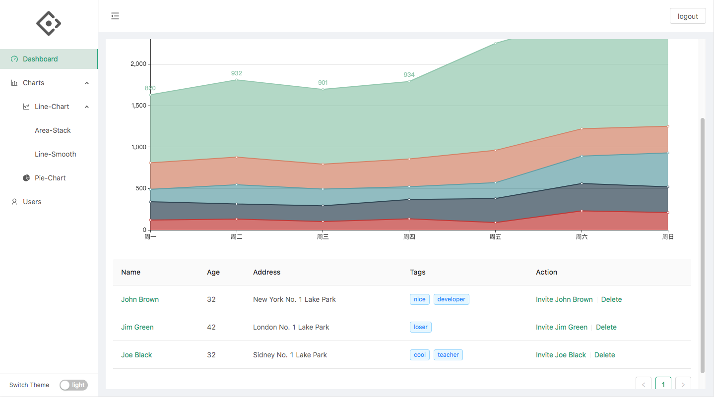

This is a simple (admin) starter with typescript, react and webpack.

Have a quick view:



## setup

> If you do not need the taobao registry, you can change it in `.npmrc`

```bash
$ npm i
```

## test

```bash
$ npm test
```

## build for development

```bash
$ npm run dev
```

## build for production

```bash
$ npm run build:(qa/prod)
```

## server

We do not use any mock tools(Anyway, you can use the data format from server response to achieve it!), all data interaction depends on [a real node service with nest and mongodb](https://github.com/jackple/showcase). Integration is in our future plan! We will make sure that you still can fully separate client and server side. 😁😁😁

## characteristics

-   use [ant design](https://ant.design/index-cn) as UI framework
-   import .(s)css auto generate .(s)css.d.ts by [typed-css-modules-webpack-plugin](https://github.com/dropbox/typed-css-modules-webpack-plugin)
-   use ServiceWorker by [workbox-webpack-plugin](https://developers.google.com/web/tools/workbox/modules/workbox-webpack-plugin)
-   import svg icon as a component by `@svgr/webpack`, [there is an example in the doc of steamer-react-redux-ts](https://github.com/YDJ-FE/steamer-react-ts/blob/master/docs/svg.md)
-   create component folder by `customaddcomponents` which is added to npm script `npm run add`
-   use husky{pre-commit/commit-msg} hooks
-   use [react-intl-universal](https://github.com/alibaba/react-intl-universal) for i18n.
-   use [react-virtualized](https://github.com/bvaughn/react-virtualized) for fat list.

## pages

-   The Index page became a [Socket Debugger](https://starter.jackple.com/#/)

## TODO

-   config menu by user with permission
-   more functional pages like Socket Debugger

## component example

```jsx
import * as React from 'react'
import { observer } from 'mobx-react'
import { Button } from 'antd'

import useRootStore from '@store/useRootStore'

function Test() {
    const { routerStore } = useRootStore()

    const gotoHome = () => {
        routerStore.push('/')
    }
    return (
        <Button type="primary" onClick={gotoHome}>
            go to page index directly
        </Button>
    )
}

export default observer(Test)
```

[live example](https://github.com/YDJ-FE/ts-react-webpack4/blob/master/src/containers/views/Login/index.tsx?1532570619900)

## necessary extensions (on vscode)

-   [ESLint](https://marketplace.visualstudio.com/items?itemName=dbaeumer.vscode-eslint)

-   [stylelint](https://marketplace.visualstudio.com/items?itemName=shinnn.stylelint)

-   [Prettier - Code formatter](https://marketplace.visualstudio.com/items?itemName=esbenp.prettier-vscode)

## how to upload file to server

```bash
#!/bin/bash

TIMESPAN=$(date '+%s')
DEPLOYNAME=ts-react-webpack.qa.${TIMESPAN}
DEPLOYFILES=${DEPLOYNAME}.tar.gz
SERVER=0.0.0.0

# make compression
cd dist/qa
tar -zcvf ${DEPLOYFILES} ./*

# upload
scp -P 22 -o StrictHostKeyChecking=no ${DEPLOYFILES} node@${SERVER}:/home/pages/ts-react-webpack/tarfiles

# make decompression
ssh -p 22 -o StrictHostKeyChecking=no node@${SERVER} tar xzf /home/pages/ts-react-webpack/tarfiles/${DEPLOYFILES} -C /home/pages/ts-react-webpack

if [ $? -ne 0 ]; then
    echo "success"
else
    echo "fail"
fi
```

## how to deploy with nginx

```nginx
server {
       listen       9993;
       server_name  localhost:9993;

       location / {
             root   ~/Documents/react/ts-react-webpack/dist/qa/;
             index  index.html index.htm;
       }
 }
```

## the scaffold

[steamer-react-redux-ts](https://github.com/YDJ-FE/steamer-react-redux-ts)
